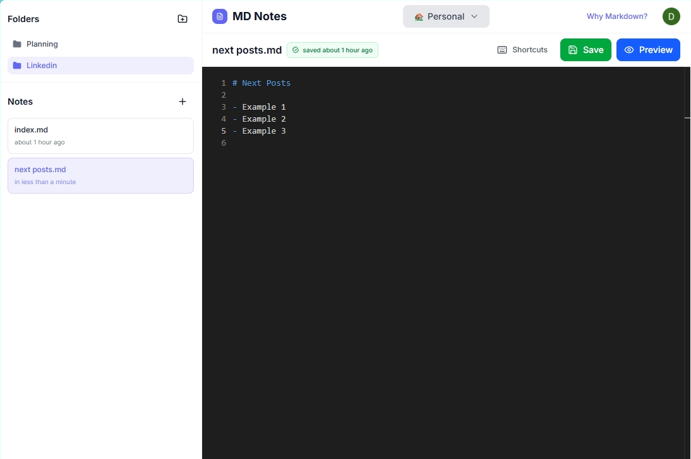

# Saas Project - MD Nodes (Public repo)

The MD Notes is a saas project that allows users to create, edit, and share markdown notes using a simple and minimalistic interface.
You can access the project on the following link: [MD Notes](https://d189amvpwtmhw6.cloudfront.net/)

## Features

- User authentication with Google.
- Separate your notes into folders or workspaces to keep them organized.
- Use AI with prompt optimization to generate notes based on your input.
- Use voice commands and AI to create notes quickly and efficiently.

## Screenshot

